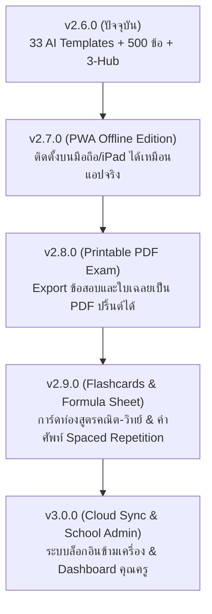

# 🎓 สรุปภาพรวมผลงานการพัฒนา & แผนพัฒนาในอนาคต (Project Summary & Roadmap)
**โครงการ:** Tutor M.1 — ระบบเตรียมสอบเข้า ม.1 ห้องเรียนพิเศษ โรงเรียนชั้นนำของไทย  
**เวอร์ชันปัจจุบัน:** `v2.6.1 (Math Accuracy & Quality Update)`  
**Repository:** `https://github.com/jairlinethai8989/tutorm1.git`  
**สถานะการพัฒนา:** ✅ พร้อมนำไป Deploy ขึ้น Vercel และใช้งานจริง 100%  

---

## 🌟 0. สิ่งที่อัปเดตและแก้ไขในเวอร์ชัน v2.6.1 (Latest Update)
- 🎯 **แก้ไขการเรนเดอร์สูตรคณิตศาสตร์ (KaTeX/LaTeX):** แก้ไข 10 ตัวเลือกใน `benchamaMath.ts` ที่ขาด `$...$` delimiters (เช่น เศษส่วน $\frac{99}{100}$, ทศนิยมซ้ำ $\frac{62}{99}$, อนุกรม $\frac{63}{64}$)
- 🛡️ **ระบบ Auto-Detect Math Formulas:** เพิ่ม Auto-wrapping ใน `MathText.tsx` เพื่อป้องกันการหลุด raw LaTeX
- 🤖 **AI Math Verification 100%:** ตรวจทานความถูกต้องทางคณิตศาสตร์ครบ 120 ข้อ (100 Benchama + 10 PCSH + 10 Supplementary) พร้อมแก้ไขโจทย์ ห.ร.ม. (`bm-math-006`) และสมการ (`bm-math-037`)
- 🔍 **Automated Validation Script 15 กฎ:** ตรวจสอบ 625+ ข้อสอบ 13 สถาบันทั่วประเทศ ผ่าน 100% (0 errors, 0 warnings)
- 📢 **ศูนย์ข้อมูล & บันทึกการอัปเดต (What's New Modal):** แสดงรายละเอียดการแก้ไขและประวัติเวอร์ชันในหน้าแอป

---

## 🌟 1. สรุปผลงานที่ทำสำเร็จแล้วในเวอร์ชัน v2.6.0

### 📚 1.1 คลังข้อสอบจริง 500+ ข้อ (5 วิชาหลักมาตรฐาน สพฐ. / มศว.)
- รวบรวมและเทียบเคียงข้อสอบตามแนวทางการออกข้อสอบคัดเลือกเข้า ม.1 ห้องพิเศษ (Gifted, SMA, SMTE, EP) ของ รร.เบ็ญจะมะมหาราช (แนว มศว.ประสานมิตร) และกลุ่มโรงเรียนวิทยาศาสตร์จุฬาภรณราชวิทยาลัย
- แบ่งครบ 5 วิชาหลัก วิชาละ 100 ข้อ รวม 16 หมวดสาระสำคัญ:
  1. **คณิตศาสตร์ (100 ข้อ):** จำนวนและการคำนวณ, พีชคณิตและสมการ, เรขาคณิตและพื้นที่, โจทย์ปัญหาร้อยละ-กำไร-ระยะทาง, สถิติและความน่าจะเป็น
  2. **วิทยาศาสตร์ (100 ข้อ):** สิ่งมีชีวิตและระบบร่างกาย, พืชและการสังเคราะห์ด้วยแสง, สารและสมบัติของสาร, ฟิสิกส์ แรงและการเคลื่อนที่, ดาราศาสตร์และธรณีวิทยา
  3. **ภาษาอังกฤษ (100 ข้อ):** Grammar & Structure, Reading Comprehension, Situational Conversation & Idioms
  4. **ภาษาไทย (100 ข้อ):** หลักภาษาและการใช้ภาษา, ราชาศัพท์และคำยืม, วรรณคดีวิจักษ์และคำประพันธ์, การอ่านจับใจความและสำนวนไทย
  5. **สังคมศึกษา (100 ข้อ):** ศาสนา ศีลธรรม จริยธรรม, หน้าที่พลเมืองและกฎหมาย, เศรษฐศาสตร์, ประวัติศาสตร์ไทย, ภูมิศาสตร์และสิ่งแวดล้อม

### 🇹🇭 1.2 ระบบเฉลยละเอียดภาษาไทย 100% (Step-by-Step + Trick & Tip)
- ทุกข้อมีเฉลยอธิบายขั้นตอนการคิดอย่างละเอียด
- **วิชาภาษาอังกฤษ:** แปลประโยคโจทย์ บทความ และบทสนทนาเป็นภาษาไทยทุกข้อ อธิบายกฎไวยากรณ์ พร้อมทั้งเกร็ดคำศัพท์และสำนวน
- มีกล่อง **💡 Trick & Tip (เทคนิคคิดลัด)** และ **⚠️ Common Mistake (จุดลวงที่นักเรียนมักทำผิดบ่อยๆ)**
- มีป้ายรับรองมาตรฐานวิชาการ: `💡 คำชี้แจง: เฉลยละเอียดจัดทำขึ้นตามแนวทางหลักสูตรแกนกลาง สพฐ. • Tutor M.1 Quality Checked ✓`

### 🎲 1.3 ระบบสุ่มโจทย์ AI Practice (Dynamic Question Generator 33 รูปแบบ 0 บาท)
- แก้ปัญหาโจทย์ไม่พอด้วย **Deterministic Mathematical Template Engine** โดยไม่ต้องจ่ายค่า API AI สักบาท
- ครอบคลุม 33 แม่แบบโจทย์คำนวณคณิตศาสตร์และฟิสิกส์ 6 หมวดหมู่:
  - เลขคณิตพื้นฐาน (ห.ร.ม., ค.ร.น., เศษส่วน, แยกตัวประกอบเฉพาะ)
  - พีชคณิตและสมการ (สมการเชิงเส้น 1-2 ตัวแปร, ลำดับเลขคณิต, โจทย์อายุ, ผลบวกจำนวนเรียงกัน)
  - เรขาคณิต (พื้นที่สามเหลี่ยม, สี่เหลี่ยมคางหมู, วงกลม/วงแหวน, พีทาโกรัส, ทรงกระบอก, ลูกบาศก์, กรวย)
  - โจทย์ประยุกต์ (ร้อยละ, กำไร-ขาดทุน, ส่วนลด, อัตราเร็ว ระยะทาง เวลา, การทำงานร่วมกัน)
  - สถิติและความน่าจะเป็น (ค่าเฉลี่ย, มัธยฐาน, ความน่าจะเป็นลูกบอล, ทอยลูกเต๋า)
  - วิทยาศาสตร์ฟิสิกส์คำนวณ (กฎของโอห์ม, วงจรอนุกรม-ขนาน, ค่าไฟฟ้า/พลังงาน, ความหนาแน่น, งานและพลังงาน)
- ระบบสร้างตัวเลือกคำตอบผิด (Distractors) อย่างชาญฉลาดโดยอิงจากข้อผิดพลาดทั่วไปของนักเรียน

### ⏱️ 1.4 ระบบจำลองสอบเสมือนจริง (Timed Mock Exam 10+ ชุด)
- มีห้องสอบจำลองของโรงเรียนดัง (เบ็ญจะมะมหาราช, จุฬาภรณราชวิทยาลัย, สตรีวิทยา, สวนกุหลาบ, ศึกษานารี, ฤทธิยะ, สารวิทยา ฯลฯ)
- มีตัวจับเวลานับถอยหลังจริง, กระดาษคำตอบดิจิทัล, และการประเมินผลผ่าน/ไม่ผ่านตามเกณฑ์คะแนนจริง

### 🗂️ 1.5 หน้าจอหลักแบบ 3 Master Categories Hub (สะอาด เรียบหรู ไม่รกตา)
- หน้าแรกจัดระเบียบเป็น 3 หมวดหมู่หลักแบบคลิกสลับ Tab:
  1. 📚 **หมวดฝึกหัด 5 วิชาหลัก** *(500+ ข้อจริง)*
  2. ⏱️ **หมวดระบบจำลองสอบเสมือนจริง** *(10+ ชุด)*
  3. 🎲 **หมวด AI Practice** *(33 แบบ สุ่มไม่จำกัด)*
- คลิกเลือกหมวดหลักแล้วจะแสดงเฉพาะหมวดหมู่ย่อย ช่วยให้หน้าจอไม่ยาวและไม่รกตา

### 🔒 1.6 ระบบจดจำข้อมูลผู้ใช้รายบุคคล & ความเป็นส่วนตัว (Device Data Isolation)
- ข้อมูลการทำข้อสอบถูกเก็บแยกใน LocalStorage ของอุปกรณ์แต่ละเครื่อง 100% ไม่ปะปนกับผู้ใช้อื่น
- มี **ฟังก์ชันตั้งชื่อผู้เรียน (Student Profile)** และ **ปุ่ม "ล้างข้อมูลเครื่องนี้ (Reset Data)"** ใน 1 คลิก
- **แก้ไขปัญหา UI Modal ด้วย React Portal (`createPortal`)** ให้หน้าต่างคำแนะนำลอยเด่นอยู่ชั้นบนสุด `z-[999999]` ไม่จมหรือถูกบดบังในทุกอุปกรณ์

---

## 🚀 2. แผนพัฒนาเวอร์ชันถัดไป (Future Roadmap: v2.7.0 - v3.0.0)

เพื่อต่อยอดให้ระบบสมบูรณ์แบบและตอบโจทย์การนำไปใช้งานในวงกว้างมากยิ่งขึ้น ขอเสนอแผนงานพัฒนาในอนาคตเป็นระยะๆ ดังนี้ครับ:

---

### 📱 ระยะที่ 1: เวอร์ชัน `v2.7.0` (PWA & Offline Installation)
* **เป้าหมาย:** ทำให้นักเรียนและผู้ปกครองสามารถ "ติดตั้งลงบนหน้าจอมือถือ/iPad" ได้เหมือนแอปจริงจาก App Store / Play Store
* **ฟีเจอร์เด่น:**
  1. ใส่ `manifest.json` และ Service Worker สำหรับการโหลดข้อมูลแบบแคช (Offline First)
  2. ป๊อปอัปแนะนำวิธี *"เพิ่มไปยังหน้าจอโฮม (Add to Home Screen)"* บน Safari (iOS) และ Chrome (Android)
  3. สามารถเปิดใช้งานและทำข้อสอบได้แม้ในขณะที่ไม่มีสัญญาณอินเทอร์เน็ต

---

### 📄 ระยะที่ 2: เวอร์ชัน `v2.8.0` (Printable PDF Export & Worksheet Generator)
* **เป้าหมาย:** รองรับการพิมพ์ข้อสอบออกมาทำบนกระดาษสำหรับผู้ปกครองหรือคุณครูที่ต้องการจัดสอบในห้องเรียน
* **ฟีเจอร์เด่น:**
  1. ปุ่ม **"พิมพ์ชุดข้อสอบ (Print Exam)"** ออกมาเป็นไฟล์ PDF หน้าตาสวยงาม พร้อมกระดาษคำตอบสำหรับฝน
  2. ปุ่ม **"พิมพ์ใบเฉลยละเอียด (Answer Key PDF)"** สำหรับให้ผู้ปกครองตรวจคำตอบ
  3. เลือกสุ่มโจทย์ AI Practice จัดเป็นแบบฝึกหัดท้ายคาบเรียน (Worksheet Generator)

---

### 🧠 ระยะที่ 3: เวอร์ชัน `v2.9.0` (Smart Flashcards & Formula Cheat Sheets)
* **เป้าหมาย:** เสริมการจำสูตรคณิต-วิทย์ และคำศัพท์ภาษาอังกฤษด้วยระบบทบทวนอัจฉริยะ
* **ฟีเจอร์เด่น:**
  1. **Flashcards การ์ดคำศัพท์ & สูตรสำคัญ:** แตะเพื่อพลิกดูคำแปลและวิธีใช้
  2. **ระบบ Spaced Repetition (SRS):** คำศัพท์หรือสูตรที่ตอบผิดบ่อยจะถูกนำกลับมาถามซ้ำบ่อยขึ้น
  3. **แผ่นสรุปสูตรลัดพกพา (Cheat Sheet):** รวมสูตรคณิตศาสตร์ ฟิสิกส์ และสรุป Tense ภาษาอังกฤษหน้าเดียว

---

### ☁️ ระยะที่ 4: เวอร์ชัน `v3.0.0` (Cloud Account, Sync & Teacher/Parent Mode)
* **เป้าหมาย:** เชื่อมต่อหลายอุปกรณ์ และเปิดโอกาสให้คุณครู/สถาบันกวดวิชาบริหารจัดการนักเรียน
* **ฟีเจอร์เด่น:**
  1. **ระบบล็อกอิน (Google / LINE Login):** ซิงก์คะแนนข้ามระหว่างคอมพิวเตอร์ แท็บเล็ต และมือถือได้
  2. **Teacher / Parent Dashboard:** ผู้ปกครองและคุณครูสามารถดูลำดับพัฒนาการและจุดอ่อนของนักเรียนแบบเรียลไทม์
  3. **Leaderboard ประจำสัปดาห์:** กระดานคะแนนสำหรับท้าทายความพร้อมสอบกับเพื่อนๆ ทั่วประเทศ

---

## 🛠️ สรุปเทคโนโลยีที่ใช้ (Tech Stack)
- **Framework:** Next.js 15 (App Router) + React 19 + TypeScript
- **Styling & UI:** Tailwind CSS v4 + Lucide React Icons
- **Math Rendering:** KaTeX (Mathematical LaTeX Engine)
- **Charts & Graphics:** Recharts + HTML5 Canvas Confetti
- **Question Engine:** Deterministic Template Engine (0 Cost, 100% Math Accuracy)
- **Deployment:** Vercel / Cloudflare Pages Ready

---
*จัดทำเอกสารเมื่อ: 22 สิงหาคม 2026*  
*บันทึกไว้ใน `PROJECT_SUMMARY.md` และ `walkthrough.md` เรียบร้อยแล้วครับ*
